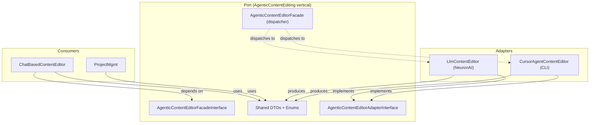
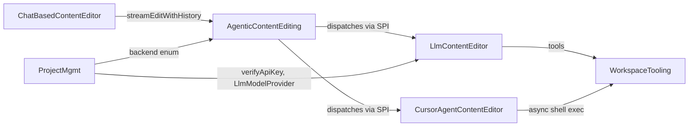

# Agentic Content Editing Abstraction Layer

## Brief

We need to properly integrate the self-contained Cursor CLI binary as an alternative Content Editor Agent that can be used alongside our homegrown solution based on the NeuronAI framework. Branch `feat/cursor-agent-integration` contains a proof of concept.

The focus is on one main aspect: the **architectural patterns around a clean integration point**. How can we design the codebase in a way that allows the very-different-in-nature agent implementations ("make" versus "buy") to look as uniform and compatible to as much of the codebase as possible?

We need a kind of facade or anti-corruption layer — similar to how a good design makes a local Unix filesystem and a remote S3 bucket feel "uniform" for other layers and verticals of the codebase. The abstraction should be as little leaky as possible. We don't want to face the fact that these are two very-different-in-nature sub-systems at every turn of the code.

If this requires slicing the existing architecture into more verticals, re-designing the cut, and/or reshaping the encapsulation surface of the current agent system, then so be it.

Additional constraints:

- The vertical should be named `AgenticContentEditing` — that's more fitting than a generic `ContentEditing`.
- A certain amount of deliberate "leaking" is in order: call sites outside of the new vertical's facade should be able to *know* what backend they are running — they just shouldn't need a parade of `if type=cursor else` constructs on top of it. The agentic backend must remain configurable per project.
- Alongside `tool_calling`/`tool_called` normalization, `tool_error` should be part of the canonical event kinds.

---

## Problem Analysis: Why the PoC Leaks

The `feat/cursor-agent-integration` branch has the right idea (adapter pattern, separate vertical for Cursor) but the abstraction is placed incorrectly and leaks in several ways:

1. **DTOs in the wrong vertical**: `CursorAgentContentEditor` imports DTOs from `LlmContentEditor/Facade/Dto/` — making a "competing" implementation depend on another implementation's public API. This is like having an S3 filesystem driver import types from the local-filesystem driver.
2. **Adapter pattern in the consumer**: The adapter dispatching (`ContentEditorAdapterInterface`, `ContentEditorFacade`) is in `ChatBasedContentEditor/Infrastructure/`, forcing the consumer to know both backends exist.
3. **Backend-specific leakage into the handler**: `RunEditSessionHandler` has explicit `ContentEditorBackend::CursorAgent` checks, Cursor-specific session ID handling, and backend-specific image selection (`CURSOR_AGENT_IMAGE`).
4. **Duplicate enums**: `ContentEditorBackend` is defined in both `ChatBasedContentEditor/Domain/Enum/` and `ProjectMgmt/Facade/Enum/`.
5. **Backend-specific event kinds**: `build_start`, `build_complete`, `build_error` are Cursor-only events that leak into the frontend TypeScript.

## Target Architecture

The solution follows the **hexagonal port/adapter pattern** with a dedicated vertical owning the neutral protocol:



### Deliberate Transparency vs. Branching

The goal is **not** to hide the backend identity entirely — call sites should be able to *know* which backend they're talking to (via the `AgenticContentEditorBackend` enum). What the abstraction prevents is the need to *branch on it* at every turn. Consumers can read the backend for logging, display, or feature flags. They just shouldn't need `if backend === CursorAgent then X else Y` to make the core editing flow work.

The backend remains a per-project configuration (stored on `Project`, propagated to `Conversation`). The facade accepts it as a parameter and dispatches accordingly.

## New Vertical: `AgenticContentEditing/`

This vertical owns the protocol — the shared contract that both backends adapt to, and that all consumers depend on.

```
src/AgenticContentEditing/
├── Facade/
│   ├── AgenticContentEditorFacadeInterface.php    # The port (what consumers call)
│   ├── AgenticContentEditorAdapterInterface.php   # The SPI (what backends implement)
│   ├── AgenticContentEditorFacade.php             # Dispatches to adapters via DI
│   ├── Dto/
│   │   ├── AgentConfigDto.php                     # Moved from LlmContentEditor
│   │   ├── AgentEventDto.php                      # Moved from LlmContentEditor
│   │   ├── ConversationMessageDto.php             # Moved from LlmContentEditor
│   │   ├── EditStreamChunkDto.php                 # Moved from LlmContentEditor
│   │   └── ToolInputEntryDto.php                  # Moved from LlmContentEditor
│   └── Enum/
│       ├── AgenticContentEditorBackend.php        # Single source of truth
│       └── EditStreamChunkType.php                # Moved from LlmContentEditor
```

### The Port: `AgenticContentEditorFacadeInterface`

```php
namespace App\AgenticContentEditing\Facade;

interface AgenticContentEditorFacadeInterface
{
    /**
     * @param list<ConversationMessageDto> $previousMessages
     * @return Generator<EditStreamChunkDto>
     */
    public function streamEditWithHistory(
        AgenticContentEditorBackend $backend,
        string                      $workspacePath,
        string                      $instruction,
        array                       $previousMessages,
        string                      $apiKey,
        AgentConfigDto              $agentConfig,
        ?string                     $backendSessionState = null,
        string                      $locale = 'en',
    ): Generator;
}
```

### The SPI: `AgenticContentEditorAdapterInterface`

```php
namespace App\AgenticContentEditing\Facade;

interface AgenticContentEditorAdapterInterface
{
    public function supports(AgenticContentEditorBackend $backend): bool;

    /**
     * @param list<ConversationMessageDto> $previousMessages
     * @return Generator<EditStreamChunkDto>
     */
    public function streamEdit(
        string         $workspacePath,
        string         $instruction,
        array          $previousMessages,
        string         $apiKey,
        AgentConfigDto $agentConfig,
        ?string        $backendSessionState = null,
        string         $locale = 'en',
    ): Generator;
}
```

### The Dispatcher: `AgenticContentEditorFacade`

Receives adapters via Symfony DI tagged services. Resolves the correct adapter based on the `AgenticContentEditorBackend` enum and delegates. Zero backend-specific logic.

## Key Design Patterns

### 1. Opaque Session State (replaces `cursorAgentSessionId`)

The PoC has a `cursorAgentSessionId` field on the `Conversation` entity and a `getLastCursorAgentSessionId()` method on the adapter interface — both are Cursor-specific leaks.

Replace with an **opaque `backendSessionState`** string:

- The `done` chunk in `EditStreamChunkDto` gains a `?string $backendSessionState` field
- The consumer (`ChatBasedContentEditor`) stores it on the `Conversation` entity as a generic `?string $backendSessionState` column
- On the next turn, the consumer passes it back into `streamEditWithHistory()`
- The LLM adapter ignores it (returns null). The Cursor adapter uses it as the `--resume` session ID.
- **No backend-specific fields on any entity. No `getLastCursorAgentSessionId()` on any interface.**

### 2. Normalized Agent Event Kinds (replaces `build_*` events)

The PoC added `build_start`/`build_complete`/`build_error` event kinds that only apply to the Cursor agent's post-agent build step. These leak into the frontend TypeScript.

Instead, the Cursor adapter should emit the standard tool lifecycle events with `toolName: 'run_build'`. The canonical event kinds become:

- `inference_start`, `inference_stop` — LLM thinking phases
- `tool_calling` — a tool invocation has started
- `tool_called` — a tool invocation completed successfully
- `tool_error` — a tool invocation failed (new; useful for both backends)
- `agent_error` — unrecoverable agent-level failure

```php
// Cursor adapter, after CLI completes:
yield new EditStreamChunkDto('event', null, new AgentEventDto('tool_calling', 'run_build'));
try {
    $buildOutput = $this->workspaceTooling->runBuildInWorkspace(...);
    yield new EditStreamChunkDto('event', null, new AgentEventDto('tool_called', 'run_build', null, $buildOutput));
} catch (RuntimeException $e) {
    yield new EditStreamChunkDto('event', null, new AgentEventDto('tool_error', 'run_build', null, null, $e->getMessage()));
}
```

The frontend already knows how to display `tool_calling`/`tool_called` events. `tool_error` is a small addition that maps naturally to the existing event rendering (same shape as `tool_called` but with `errorMessage`). The `build_*` event kinds and their frontend handling are removed entirely.

### 3. Backend-Specific Configuration Stays Inside Adapters

The PoC's `RunEditSessionHandler` has:

```php
if ($conversation->getContentEditorBackend() === ContentEditorBackend::CursorAgent) {
    $cursorAgentImage = $_ENV['CURSOR_AGENT_IMAGE'] ?? null;
    // ...
    $agentImage = $cursorAgentImage;
}
```

This should be entirely inside the Cursor adapter. The adapter is responsible for its own container image, environment variables, and configuration. The handler just calls `streamEditWithHistory()` — it never branches on backend type.

## Refactored `LlmContentEditor/`

The `LlmContentEditor/` vertical keeps its **LLM-specific facade** for concerns that don't generalize:

- `LlmContentEditorFacadeInterface::verifyApiKey()` — LLM-specific key verification
- `LlmContentEditorFacadeInterface::buildAgentContextDump()` — LLM-specific debugging
- `Enum/LlmModelProvider` — LLM provider selection

It also exposes an adapter service:

```
src/LlmContentEditor/
├── Facade/
│   ├── LlmContentEditorFacadeInterface.php    # LLM-specific methods only
│   ├── LlmContentEditorFacade.php
│   └── Enum/
│       └── LlmModelProvider.php               # Stays here (LLM-specific)
├── Domain/
│   └── Agent/ContentEditorAgent.php           # NeuronAI agent (unchanged)
└── Infrastructure/
    ├── LlmContentEditorAdapter.php            # Implements ContentEditorAdapterInterface
    └── ...existing infrastructure...
```

The `LlmContentEditorAdapter` wraps the existing `LlmContentEditorFacade::streamEditWithHistory()` logic, adapting it to the SPI interface. Essentially, the existing facade implementation moves to the adapter, and the facade becomes a thin wrapper for LLM-specific operations only.

## Refactored `CursorAgentContentEditor/`

```
src/CursorAgentContentEditor/
├── Domain/
│   ├── Agent/ContentEditorAgent.php              # CLI command builder
│   └── Command/EditContentCommand.php            # Symfony console (for testing)
└── Infrastructure/
    ├── CursorAgentContentEditorAdapter.php        # Implements ContentEditorAdapterInterface
    ├── Observer/ConsoleObserver.php
    └── Streaming/CursorAgentStreamCollector.php
```

The adapter handles:

- Agent image resolution (via `CURSOR_AGENT_IMAGE` env var, internally)
- Session ID extraction from stream (via `CursorAgentStreamCollector`)
- Post-agent build step (emitted as standard `tool_calling`/`tool_called` events)
- Session state packaging (returns session ID as `backendSessionState` on the `done` chunk)

No facade needed — this vertical only provides an adapter implementation. If a Cursor-specific management facade is needed later (e.g., session cleanup), it can be added then.

## Refactored `ChatBasedContentEditor/`

The handler becomes clean:

```php
// RunEditSessionHandler - ZERO backend-specific code
$generator = $this->contentEditorFacade->streamEditWithHistory(
    $conversation->getContentEditorBackend(),  // from AgenticContentEditing/Facade/Enum
    $session->getWorkspacePath(),
    $session->getInstruction(),
    $previousMessages,
    $project->llmApiKey,
    $agentConfig,
    $conversation->getBackendSessionState(),   // opaque, pass-through
    $message->locale,
);

foreach ($generator as $chunk) {
    // ... handle chunks uniformly ...
    
    if ($chunk->chunkType === EditStreamChunkType::Done) {
        // Store opaque session state for next turn
        if ($chunk->backendSessionState !== null) {
            $conversation->setBackendSessionState($chunk->backendSessionState);
        }
        EditSessionChunk::createDoneChunk($session, $chunk->success, $chunk->errorMessage);
    }
}
```

No `if (backend === CursorAgent)` branches. No adapter pattern internally. No backend-specific imports.

### Entity changes on `Conversation`:

- Keep `contentEditorBackend` column (use enum from `AgenticContentEditing/Facade/Enum/`)
- Replace `cursorAgentSessionId` with generic `backendSessionState` (`?string`, nullable)
- Remove internal `ContentEditorBackend` enum (use the one from `AgenticContentEditing`)

### Remove PoC adapter infrastructure:

- Delete `ChatBasedContentEditor/Infrastructure/ContentEditor/` entirely
- Delete `ChatBasedContentEditor/Domain/Enum/ContentEditorBackend.php`

## Updated Cross-Vertical Wiring



## Migration Steps

### Phase 1: Create the neutral protocol

1. Create `AgenticContentEditing/Facade/` vertical
2. Move DTOs and enums from `LlmContentEditor/Facade/Dto/` and `LlmContentEditor/Facade/Enum/EditStreamChunkType` to `AgenticContentEditing/Facade/`
3. Add `AgenticContentEditorBackend` enum (single source of truth)
4. Define `AgenticContentEditorFacadeInterface` and `AgenticContentEditorAdapterInterface`
5. Update all `use` statements across the codebase (mechanical refactoring)

### Phase 2: Create the adapters

1. Create `LlmContentEditorAdapter` in `LlmContentEditor/Infrastructure/`
2. Create `CursorAgentContentEditorAdapter` in `CursorAgentContentEditor/Infrastructure/`
3. Create `AgenticContentEditorFacade` dispatcher in `AgenticContentEditing/Facade/`
4. Wire adapters via Symfony DI tagged services

### Phase 3: Refactor the consumer

1. Update `RunEditSessionHandler` to use `AgenticContentEditorFacadeInterface` only
2. Replace `cursorAgentSessionId` with `backendSessionState` on `Conversation` entity
3. Remove `ChatBasedContentEditor/Infrastructure/ContentEditor/` (PoC adapter layer)
4. Remove duplicate `ContentEditorBackend` enums

### Phase 4: Normalize events and clean up

1. Map Cursor post-build to `tool_calling`/`tool_called`/`tool_error` events (remove `build_*` kinds)
2. Add `tool_error` event kind support to frontend TypeScript; remove `build_*` event handling
3. Update architecture tests for new vertical boundaries
4. Update `docs/vertical-wiring.md` diagram
