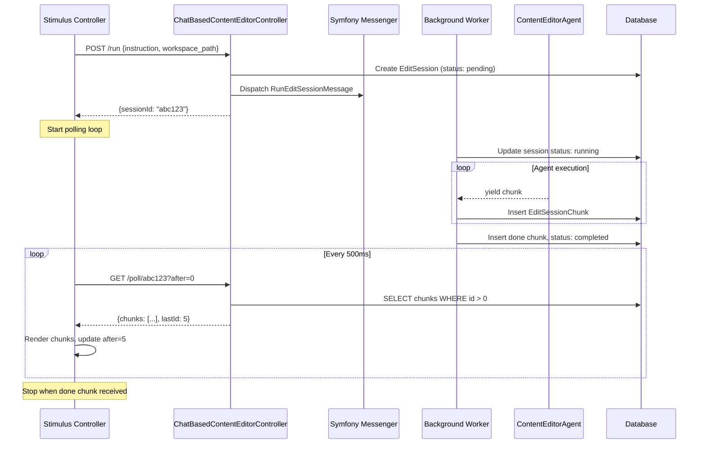

# Polling-based streaming for chat-based content editor

Replace the complex HTTP streaming with a simple database-backed polling approach.

---

## Architecture



---

## 1. Domain enums (ChatBasedContentEditor)

Create in `src/ChatBasedContentEditor/Domain/Enum/`:

**EditSessionStatus.php**

```php
enum EditSessionStatus: string
{
    case Pending = 'pending';
    case Running = 'running';
    case Completed = 'completed';
    case Failed = 'failed';
}
```

**EditSessionChunkType.php**

```php
enum EditSessionChunkType: string
{
    case Text = 'text';
    case Event = 'event';
    case Done = 'done';
}
```

---

## 2. Domain entities (ChatBasedContentEditor)

Create in `src/ChatBasedContentEditor/Domain/Entity/`:

**EditSession.php**

- `id` (UUID, primary key) — use `UuidGenerator` pattern from `AccountCore`
- `workspacePath` (string)
- `instruction` (text)
- `status` (EditSessionStatus enum)
- `createdAt` (DateTimeImmutable) — use `DateAndTimeService::getDateTimeImmutable()`

**EditSessionChunk.php**

- `id` (int, auto-increment) — easy ordering for "after" queries
- `session` (ManyToOne to EditSession)
- `chunkType` (EditSessionChunkType enum)
- `payload` (JSON — contains content/event/success/errorMessage)
- `createdAt` (DateTimeImmutable) — use `DateAndTimeService::getDateTimeImmutable()`

**Index**: Add composite index on `(session_id, id)` for efficient polling queries.

---

## 3. Messenger message and handler (ChatBasedContentEditor)

Create in `src/ChatBasedContentEditor/Infrastructure/` (handlers are infrastructure, not domain):

**Message/RunEditSessionMessage.php**

- Implements `ImmediateSymfonyMessageInterface` (routed to the `immediate` transport)
- Contains `sessionId` (string)

**Handler/RunEditSessionHandler.php**

- Injects: `EntityManagerInterface`, `LlmContentEditorFacadeInterface`
- On handle:

  1. Load EditSession by ID
  2. Update status to `Running`, flush
  3. Call `facade->streamEdit(workspacePath, instruction)`
  4. For each yielded `EditStreamChunkDto`: create and persist `EditSessionChunk`
  5. Insert final `done` chunk, update status to `Completed` (or `Failed` on exception)
  6. Log errors appropriately; sanitize error messages before storage

---

## 4. Controller changes

Modify `src/ChatBasedContentEditor/Presentation/Controller/ChatBasedContentEditorController.php`:

**POST /run** (modify existing)

- Remove `StreamedResponse` logic
- Create `EditSession` entity, persist
- Dispatch `RunEditSessionMessage`
- Return JSON: `{ sessionId: "..." }`

**GET /poll/{sessionId}** (new endpoint)

- Query `EditSessionChunk` where `session.id = sessionId AND id > after` (from query param)
- Limit results (e.g., max 100 chunks per request) to prevent large responses
- Return JSON: `{ chunks: [...], lastId: N }`
- Each chunk: `{ id, chunkType, payload }`

---

## 5. Stimulus controller changes

Modify `src/ChatBasedContentEditor/Presentation/Resources/assets/controllers/chat_based_content_editor_controller.ts`:

**On submit:**

1. POST to `/run`, get `{ sessionId }`
2. Start polling loop with `setInterval(500ms)`

**Polling loop:**

1. GET `/poll/{sessionId}?after={lastId}`
2. For each chunk in response:

   - Render based on `chunkType` and `payload`
   - Update `lastId`

3. If a chunk has `chunkType === 'done'`: stop polling, re-enable form

---

## 6. Files to create/modify

| Path | Action |
|------|--------|
| `src/ChatBasedContentEditor/Domain/Enum/EditSessionStatus.php` | Create |
| `src/ChatBasedContentEditor/Domain/Enum/EditSessionChunkType.php` | Create |
| `src/ChatBasedContentEditor/Domain/Entity/EditSession.php` | Create |
| `src/ChatBasedContentEditor/Domain/Entity/EditSessionChunk.php` | Create |
| `src/ChatBasedContentEditor/Infrastructure/Message/RunEditSessionMessage.php` | Create |
| `src/ChatBasedContentEditor/Infrastructure/Handler/RunEditSessionHandler.php` | Create |
| `src/ChatBasedContentEditor/Presentation/Controller/ChatBasedContentEditorController.php` | Modify |
| `src/ChatBasedContentEditor/Presentation/Resources/assets/controllers/chat_based_content_editor_controller.ts` | Modify |
| `config/packages/messenger.yaml` | Add routing for RunEditSessionMessage |

**After creating entities:** Run `mise run console make:migration` and `mise run console doctrine:migrations:migrate`

---

## 7. Code standards checklist

All PHP files must follow these standards:

- [ ] `declare(strict_types=1);` at top of every file
- [ ] Use `DateAndTimeService::getDateTimeImmutable()` for timestamps
- [ ] Use `list<T>` for array return types (e.g., `@return list<EditSessionChunk>`)
- [ ] No named arguments in function calls
- [ ] Enums for constrained string values (status, chunkType)
- [ ] Run `mise quality` before committing (PHPStan level 10)

---

## 8. Why this is simpler

- **No buffering issues**: Standard request/response, no nginx/PHP buffering to debug
- **Debuggable**: You can query the DB to see exactly what chunks were written
- **Resumable**: If the browser refreshes, you can resume by polling with the last known chunk ID
- **Decoupled**: Agent runs independently of the HTTP connection
- **Standard patterns**: Just entities, messages, and JSON endpoints
