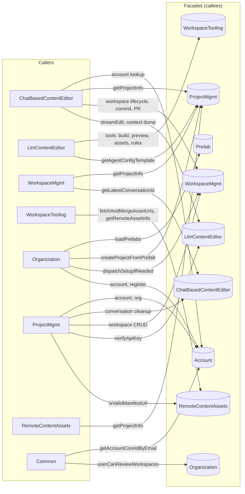

# Vertical Facade Wiring

This diagram shows **which verticals call which other verticals’ facade interface methods** — the wiring between verticals only. Internal calls within a vertical are omitted. See [archbook.md](archbook.md) for the overall facade/vertical architecture.

**Interactive version:** open [vertical-wiring-diagram.html](vertical-wiring-diagram.html) in a browser to highlight arrows on hover.

Method details are in the summary table below.

## Summary by direction

| Caller vertical           | Calls into (facade)        | Main methods |
|---------------------------|----------------------------|--------------|
| **ChatBasedContentEditor** | Account, ProjectMgmt, WorkspaceMgmt, LlmContentEditor | Workspace lifecycle, commitAndPush, streamEditWithHistory, buildAgentContextDump, account resolution |
| **LlmContentEditor**      | WorkspaceTooling, ProjectMgmt | runQualityChecks, runTests, runBuild, suggestCommitMessage, getPreviewUrl, list/search remote assets, getWorkspaceRules; getAgentConfigTemplate (EditContentCommand) |
| **WorkspaceMgmt**         | ProjectMgmt, ChatBasedContentEditor | getProjectInfo (setup, git, review); getLatestConversationId (reviewer UI) |
| **WorkspaceTooling**      | RemoteContentAssets        | fetchAndMergeAssetUrls, getRemoteAssetInfo |
| **Organization**         | Prefab, ProjectMgmt, WorkspaceMgmt, Account | loadPrefabs, createProjectFromPrefab, dispatchSetupIfNeeded; account resolution and registration |
| **ProjectMgmt** (UI)     | Account, ChatBasedContentEditor, WorkspaceMgmt, LlmContentEditor, RemoteContentAssets | Project/workspace CRUD, conversation cleanup, key/URL validation |
| **RemoteContentAssets** (UI) | ProjectMgmt              | getProjectInfo (for manifest URLs) |
| **Common** (voter)        | Account, Organization      | getAccountCoreIdByEmail; userCanReviewWorkspaces |

## Notes

- **ChatBasedContentEditor** is the main consumer of **WorkspaceMgmt** and **LlmContentEditor** (conversation flow, edit sessions, commit/push).
- **LlmContentEditor** (ContentEditorAgent) uses **WorkspaceTooling** for all tool implementations (quality checks, build, preview, remote assets, rules).
- **WorkspaceTooling** delegates remote asset listing/info to **RemoteContentAssets**.
- **Organization** onboarding (AccountCoreCreatedSymfonyEventSubscriber) wires **Prefab → ProjectMgmt → WorkspaceMgmt** to create projects and dispatch setup.
- **ProjectMgmt** presentation layer coordinates **ChatBasedContentEditor**, **WorkspaceMgmt**, **LlmContentEditor**, and **RemoteContentAssets** for project/workspace/conversation and validation flows.
