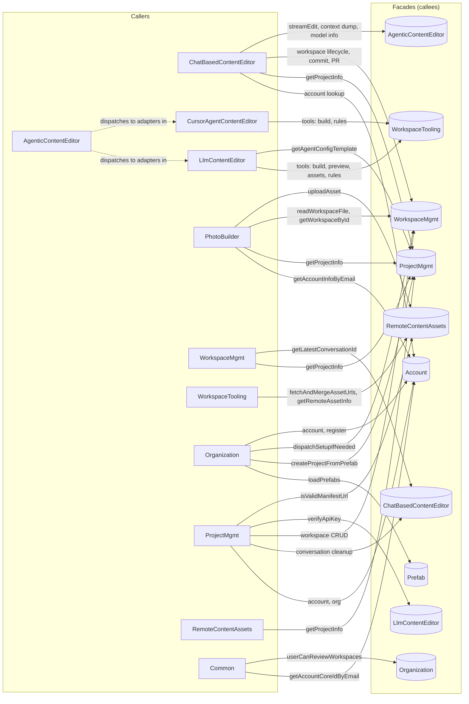

# Vertical Facade Wiring

This diagram shows **which verticals call which other verticals' facade interface methods** — the wiring between verticals only. Internal calls within a vertical are omitted. See [archbook.md](archbook.md) for the overall facade/vertical architecture.

Method details are in the summary table below.

## Summary by direction

| Caller vertical           | Calls into (facade)        | Main methods |
|---------------------------|----------------------------|--------------|
| **ChatBasedContentEditor** | Account, ProjectMgmt, WorkspaceMgmt, AgenticContentEditor | Workspace lifecycle, commitAndPush, streamEditWithHistory, buildAgentContextDump, getBackendModelInfo, account resolution |
| **AgenticContentEditor** | *(dispatches to adapters)* | Facade dispatches to `LlmContentEditorAdapter` and `CursorAgentContentEditorAdapter` via SPI |
| **LlmContentEditor**      | WorkspaceTooling, ProjectMgmt | runQualityChecks, runTests, runBuild, suggestCommitMessage, getPreviewUrl, list/search remote assets, getWorkspaceRules; getAgentConfigTemplate (EditContentCommand) |
| **CursorAgentContentEditor** | WorkspaceTooling         | runBuildInWorkspace, runShellCommandAsync, getWorkspaceRules |
| **PhotoBuilder**           | Account, ProjectMgmt, WorkspaceMgmt, RemoteContentAssets | getAccountInfoByEmail; getProjectInfo (API key, S3 config); readWorkspaceFile (page HTML), getWorkspaceById; uploadAsset (S3) |
| **WorkspaceMgmt**         | ProjectMgmt, ChatBasedContentEditor | getProjectInfo (setup, git, review); getLatestConversationId (reviewer UI) |
| **WorkspaceTooling**      | RemoteContentAssets        | fetchAndMergeAssetUrls, getRemoteAssetInfo |
| **Organization**         | Prefab, ProjectMgmt, WorkspaceMgmt, Account | loadPrefabs, createProjectFromPrefab, dispatchSetupIfNeeded; account resolution and registration |
| **ProjectMgmt** (UI)     | Account, ChatBasedContentEditor, WorkspaceMgmt, LlmContentEditor, RemoteContentAssets | Project/workspace CRUD, conversation cleanup, key/URL validation |
| **RemoteContentAssets** (UI) | ProjectMgmt              | getProjectInfo (for manifest URLs) |
| **Common** (voter)        | Account, Organization      | getAccountCoreIdByEmail; userCanReviewWorkspaces |

## Architecture: Agentic Content Editor

The **AgenticContentEditor** vertical implements a hexagonal port/adapter pattern:

- **Port** (`AgenticContentEditorFacadeInterface`): what consumers call (e.g. `ChatBasedContentEditor`).
- **SPI** (`AgenticContentEditorAdapterInterface`): what backend adapters implement.
- **Facade** (`AgenticContentEditorFacade`): dispatcher that resolves the correct adapter by backend type.

Adapters live in their respective backend verticals:
- `LlmContentEditor/Infrastructure/LlmContentEditorAdapter` — delegates to `LlmContentEditorFacade`
- `CursorAgentContentEditor/Infrastructure/CursorAgentContentEditorAdapter` — runs the Cursor CLI agent directly

Canonical DTOs and enums (`EditStreamChunkDto`, `AgentConfigDto`, `AgenticContentEditorBackend`, etc.) live in `AgenticContentEditor/Facade/` and are shared by all participants.

## Notes

- **ChatBasedContentEditor** calls **AgenticContentEditor** for all edit operations. It never imports from LlmContentEditor or CursorAgentContentEditor directly.
- **LlmContentEditor** (ContentEditorAgent) uses **WorkspaceTooling** for all tool implementations (quality checks, build, preview, remote assets, rules).
- **CursorAgentContentEditor** uses **WorkspaceTooling** for build and shell execution.
- **WorkspaceTooling** delegates remote asset listing/info to **RemoteContentAssets**.
- **Organization** onboarding (AccountCoreCreatedSymfonyEventSubscriber) wires **Prefab → ProjectMgmt → WorkspaceMgmt** to create projects and dispatch setup.
- **ProjectMgmt** presentation layer coordinates **ChatBasedContentEditor**, **WorkspaceMgmt**, **LlmContentEditor**, and **RemoteContentAssets** for project/workspace/conversation and validation flows.
- **ProjectMgmt** still calls **LlmContentEditor** directly for `verifyApiKey()` — this is intentional as API key verification is LLM-specific and part of project configuration.
- **PhotoBuilder** reads workspace page HTML via **WorkspaceMgmt**, fetches API keys and S3 config via **ProjectMgmt**, uploads generated images via **RemoteContentAssets**, and validates user access via **Account**.
