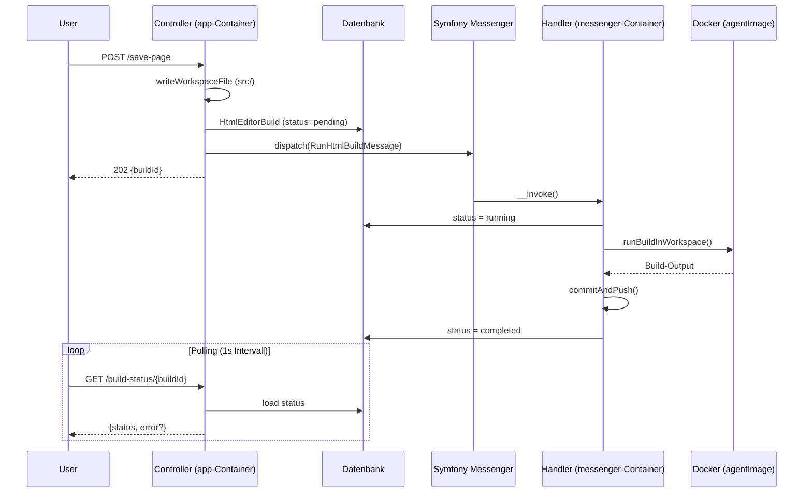

# Implementierungsplan: Asynchroner HTML-Editor Build (Issue-95)

## Ursache

- `savePage()` laeuft im **app-Container** (PHP-FPM, HTTP-Request)
- Der app-Container hat **keinen Docker-Socket** (siehe `docker-compose.yml` Zeile 7-9)
- Nur der **messenger-Container** hat den Docker-Socket (`/var/run/docker.sock`, Zeile 37)
- Daher muss der Docker-Build ueber Symfony Messenger dispatcht werden

## Neuer Ablauf

